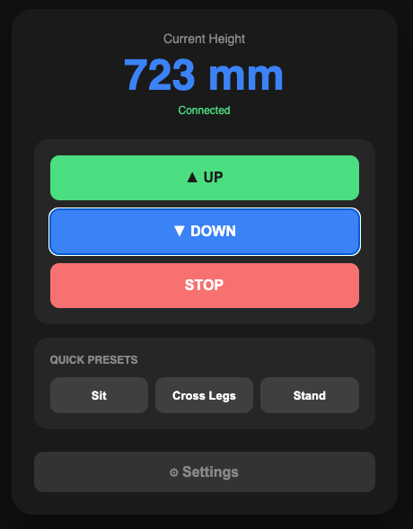

# IKEA Standing Desk Controller

A smart WiFi-enabled controller for IKEA electric standing desks that adds precise height control, preset positions, and a beautiful native macOS app.

## Screenshots

<div align="center">
  <h3>Main App Interface</h3>
  
  
  <h3>Settings View</h3>
  
</div>

## Features

- 🎯 **Precise Height Control**: Move to exact heights using a VL53L0X distance sensor
- 🍎 **Native macOS App**: Beautiful, native SwiftUI application (no browser needed!)
- 💾 **Preset Positions**: Save and recall up to 9 favorite heights (Sit, Stand, Focus, etc.)
- 🛡️ **Safety Limits**: Configurable min/max height limits with automatic stop protection
- ⚡ **Real-time Monitoring**: Live height display with smooth updates while moving
- 🎮 **Multiple Control Methods**:
  - Manual up/down buttons (hold to move)
  - Quick preset buttons
  - Manual height input in Settings
- 🔧 **Smart Movement Detection**: Height freezes when desk stops, updates live while moving
- 📶 **WiFi Manager**: Easy setup with captive portal - no code editing required!
- 🔄 **Auto-Reconnect**: Automatically reconnects if WiFi drops
- ⚠️ **Inline Validation**: Clear error messages in Settings (no annoying popups)

## Quick Start

### 1. Download and Install

**macOS App:**
- Download the latest release from [Releases](https://github.com/alexwrzski/Desk-Height-Controller/releases)
- Open `DeskController.dmg` (or `DeskController.app` if available)
- Drag to Applications folder
- Launch from Applications or Spotlight

**ESP32 Firmware:**
- Download `DeskController_ESP32.ino` from [Releases](https://github.com/alexwrzski/Desk-Height-Controller/releases)
- Upload to ESP32 using Arduino IDE or PlatformIO
- See [Hardware Setup](#hardware-setup) below for wiring details

### 2. Configure WiFi (First Time Only)

**Option A: Automatic Setup (Recommended)**
1. ESP32 will create WiFi network: **"DeskController-Setup"**
2. Connect your phone/computer to this network (password: `setup12345`)
3. Setup page opens automatically in browser
4. Enter your WiFi credentials and connect
5. Note the ESP32 IP address shown
6. Enter this IP in the macOS app Settings → ESP32 IP Address

**Option B: Manual Configuration**
- If ESP32 already has WiFi credentials saved, it will connect automatically
- Find ESP32 IP address in router admin or serial monitor
- Enter IP in macOS app Settings → ESP32 IP Address

### 3. Use the App

1. Launch DeskController from Applications
2. The app will automatically connect to your ESP32
3. Use the UP/DOWN buttons to move your desk
4. Create presets in Settings for quick access
5. Configure height limits for safety

## Project Structure

```
Desk Controller - Swift/
├── DeskController/                    # macOS Swift app source
│   ├── DeskControllerApp.swift       # Main app entry point
│   ├── ContentView.swift             # Main UI
│   ├── SettingsView.swift            # Settings modal
│   ├── AppState.swift                # App state management
│   ├── ESP32Client.swift             # ESP32 communication
│   └── Assets.xcassets/              # App icons and assets
├── DeskController_ESP32/
│   └── DeskController_ESP32.ino     # ESP32 firmware
├── docs/                             # Documentation
│   ├── SETUP_GUIDE.md               # Detailed setup instructions
│   ├── TESTING_GUIDE.md              # Testing guide
│   ├── BUILD_INSTRUCTIONS.md        # Build instructions
│   └── XCODE_BUILD.md               # Xcode build guide
├── assets/                           # Logo and assets
└── README.md                         # This file
```

## Requirements

### Hardware
- ESP32 development board
- VL53L0X Time-of-Flight distance sensor
- 2-channel relay module
- IKEA electric standing desk with manual up/down buttons

### Software
- macOS 11.0 or later (for the app)
- Arduino IDE or PlatformIO (for ESP32 firmware)
- Xcode 13+ (if building from source)

## Usage

### Manual Control
- **UP/DOWN buttons**: Hold to move, release to stop
- **STOP button**: Immediately stops any movement
- Height updates live while moving, freezes when stopped

### Presets
- Click any preset button to move to that saved height
- You can stop the movement at any time using the STOP button
- Add up to 9 custom presets in Settings

### Settings
- **ESP32 IP Address**: Configure the WiFi IP of your ESP32
- **Manage Presets**: Add, edit, or remove preset positions
- **Safety Limits**: Configure min/max height boundaries
- **Manual Movement**: Enter a specific height (in mm) to move to

## Hardware Setup

The controller uses relays soldered directly to the up/down buttons on the IKEA desk's control panel. The VL53L0X sensor is mounted on the bottom of the desk surface to measure height.

**Wiring:**
- ESP32 GPIO pins → Relay module inputs
- Relay outputs → Desk up/down button connections
- VL53L0X sensor → ESP32 I2C (SDA/SCL)
- Power: 5V for relays, 3.3V for ESP32

For detailed hardware setup, wiring diagrams, and parts list, see [docs/SETUP_GUIDE.md](docs/SETUP_GUIDE.md).

## Building from Source

### macOS App

1. Open `DeskController.xcodeproj` in Xcode
2. Select your Mac as the build target
3. Build and Run (⌘R)
4. Or build from command line:
   ```bash
   xcodebuild -project DeskController.xcodeproj -scheme DeskController -configuration Release build
   ```

See [docs/XCODE_BUILD.md](docs/XCODE_BUILD.md) for detailed build instructions.

### ESP32 Firmware

1. Install Arduino IDE or PlatformIO
2. Install ESP32 board support
3. Open `DeskController_ESP32/DeskController_ESP32.ino`
4. Upload to your ESP32 board

## Safety Features

- **Emergency stops** at configured limits (minHeight + 10mm, maxHeight - 10mm)
- **Physical limit detection**: Automatically stops when desk can't move further
- **Movement timeout**: 30-second safety timeout
- **Continuous monitoring**: All movement types respect safety limits
- **Height stabilization**: Height display freezes when desk stops moving

## Troubleshooting

### Desk not moving
- Check WiFi connection (ESP32 LED should be solid on)
- Verify ESP32 IP address in Settings
- Check relay connections
- Check serial monitor for error messages

### Height readings incorrect
- Ensure sensor is mounted securely on desk bottom
- Check sensor wiring (SDA/SCL connections)
- Verify sensor is within range (VL53L0X range: ~30-2000mm)
- Check ESP32 serial monitor for sensor errors

### Can't connect to ESP32
- Check ESP32 IP address in Settings → ESP32 IP Address
- Ensure ESP32 and Mac are on same WiFi network
- Use "Test Connection" in Settings to verify connectivity
- Check ESP32 serial monitor for connection status
- Try resetting ESP32 or re-uploading firmware

### WiFi Setup Issues
- **ESP32 not creating "DeskController-Setup" network**: 
  - Check serial monitor for errors
  - Try resetting ESP32 or re-uploading firmware
- **Can't access setup page**: 
  - Connect to "DeskController-Setup" WiFi first
  - Open any browser - setup page should open automatically
  - Or manually navigate to `http://192.168.4.1/setup`
- **WiFi connection fails**: 
  - Ensure network is 2.4GHz (ESP32 doesn't support 5GHz)
  - Check password is correct
  - Verify network is in range

### App Issues
- **App won't launch**: Check macOS version (requires 11.0+)
- **Height not updating**: Check ESP32 connection in Settings
- **Window too large**: This was fixed in latest version - update to latest release

## Releases

Download the latest release from the [Releases page](https://github.com/alexwrzski/Desk-Height-Controller/releases), which includes:
- Pre-built macOS app (`.app` bundle or `.dmg` installer)
- ESP32 firmware source code (`.ino` file)

## License

This project is open source and available for personal use.

## Contributing

Feel free to submit issues or pull requests if you have improvements!
